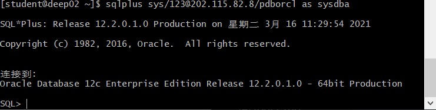

# 实验2：用户及权限管理

## 实验目的：

掌握用户管理、角色管理、权根维护与分配的能力，掌握用户之间共享对象的操作技能。

## 实验内容：

Oracle有一个开发者角色resource，可以创建表、过程、触发器等对象，但是不能创建视图。本训练要求：

- 在pdborcl插接式数据中创建一个新的本地角色con_res_view，该角色包含connect和resource角色，同时也包含CREATE VIEW权限，这样任何拥有con_res_view的用户就同时拥有这三种权限。
- 创建角色之后，再创建用户new_user，给用户分配表空间，设置限额为50M，授予con_res_view角色。
- 最后测试：用新用户new_user连接数据库、创建表，插入数据，创建视图，查询表和视图的数据。

## 实验步骤

- 第1步：以system登录到pdborcl，创建角色con_gwh_view和用户gwh_user，并授权和分配空间：

> 语句“ALTER USER new_user QUOTA 50M ON users;”是指授权new_user用户访问users表空间，空间限额是50M。

- 第2步：新用户new_user连接到pdborcl，创建表mytable和视图myview，插入数据，最后将myview的SELECT对象权限授予hr用户。

- 第3步：用户hr连接到pdborcl，查询new_user授予它的视图myview

> 测试一下同学用户之间的表的共享，只读共享和读写共享都测试一下。

## 数据库和表空间占用分析

> 当全班同学的实验都做完之后，数据库pdborcl中包含了每个同学的角色和用户。
> 所有同学的用户都使用表空间users存储表的数据。
> 表空间中存储了很多相同名称的表mytable和视图myview，但分别属性于不同的用户，不会引起混淆。
> 随着用户往表中插入数据，表空间的磁盘使用量会增加。

## 查看数据库的使用情况

以下样例查看表空间的数据库文件，以及每个文件的磁盘占用情况。

## 实验总结

​	本次oracle用户以及权限管理实验，我们成功创建了用户以及对应视图，并将视图权限赋予用户，进行查看，以及将视图赋予hr用户，能对视图查看。此外我们还对数据库使用情况进行的查询，由于所有学生都会创建一个用户以及对应的视图，数据库的容量时会发生变化的。我们也利用hr用户对其他同学的视图进行了查询操作。
